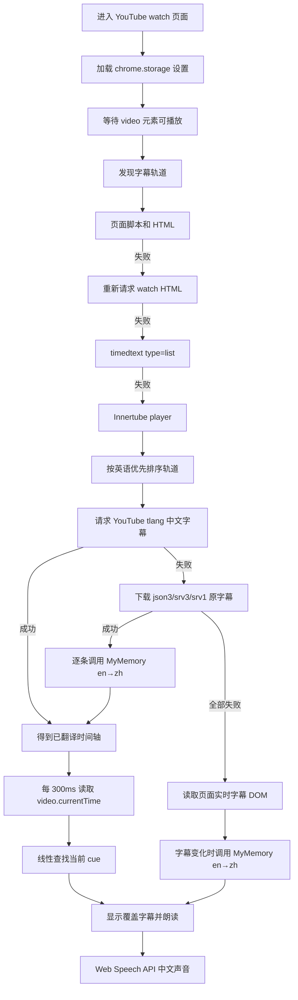

# 当前架构（v2.7）

## 审计范围

项目是一个无构建步骤的 Chrome Manifest V3 扩展，运行代码只有 `content.js`、`popup.html`、`popup.js` 和 `manifest.json`。根目录当前没有 README、项目级 AGENTS.md、package.json、测试、构建配置或后端服务。

## 运行组件

| 组件 | 职责 |
| --- | --- |
| `manifest.json` | 注册 content script、弹窗和 YouTube/MyMemory 域名权限 |
| `content.js` | 设置加载、字幕发现与下载、翻译、字幕覆盖层、浏览器 TTS、同步和 SPA 导航 |
| `popup.html` | 提供翻译开关、朗读开关和语速滑块 |
| `popup.js` | 使用 `chrome.storage.local` 读取和保存设置 |
| YouTube 页面/API | 提供字幕轨道、字幕内容、官方 `tlang` 翻译和播放器时钟 |
| MyMemory API | YouTube 官方翻译失败后的文本翻译回退 |
| Web Speech API | 使用系统中文声音朗读翻译文本 |

项目没有后台脚本、service worker、offscreen document、音频管线或自有模型调用层。

## 完整数据流

### 1. 初始化与设置

`content.js` 防止重复注入后，从 `chrome.storage.local` 加载 `translateEnabled`、`ttsEnabled`、`speechRate` 和固定目标语言 `zh`。弹窗只暴露前三项。

### 2. 字幕轨道发现

轨道发现按以下顺序回退：

1. 扫描当前页面脚本与完整 HTML 中的 `ytInitialPlayerResponse` 或 `captionTracks`。
2. 重新请求当前视频 watch HTML 并重复解析。
3. 请求 `api/timedtext?type=list` 并解析 XML。
4. 从页面提取 Innertube API key，调用内部 `youtubei/v1/player`。

每轮初始化最多整体重试三次。该链路提高可用性，但依赖 YouTube 非稳定页面结构和内部接口。

### 3. 字幕选择与翻译

轨道选择固定优先英语人工字幕、英语自动字幕、其他英语、任意人工字幕。翻译先尝试向 YouTube 字幕 URL 增加 `tlang=zh-Hans`；成功时直接把返回文本视作翻译结果。

如果 YouTube 官方翻译失败，扩展下载原字幕，再逐条调用 MyMemory。该回退把语言对硬编码为 `en|zh`，因此韩语和日语轨道即使能下载，也会按英语发送，结果不可靠。当前没有语言检测、模型路由、术语表或翻译质量评估。

### 4. 实时字幕回退

字幕文件全部下载失败时，扩展尝试开启 YouTube 原字幕，并从 `.ytp-caption-segment` 或 `.captions-text` 读取可见文本。文本变化后调用 MyMemory、显示译文并朗读。

当一次翻译尚未结束而字幕再次变化时，新文本可能被跳过：状态已经更新为最新文本，但不会自动补发翻译请求。

### 5. 字幕显示与音频同步

下载字幕模式每 300ms 读取 `video.currentTime`，在线性数组中查找时间覆盖当前播放点的 cue。找到新 cue 后立即显示并朗读。

同步只基于字幕时间戳，不考虑 TTS 生成时长、播放延迟、视频倍速、暂停后的语音状态或相邻句重叠。每个新 cue 都执行 `speechSynthesis.cancel()`，长句容易被下一句截断。

### 6. TTS

扩展筛选系统 `zh`/`cmn` 声音，并优先选择少量已知名称。朗读由浏览器 `SpeechSynthesisUtterance` 完成，只有语速可调；没有音色管理、情绪、韵律、说话人分配、音频缓存或时长预测。

## 运行边界

- 所有状态都保存在单个 content script 内存中，切换视频时清空。
- 翻译缓存只以原文本为键，不包含源语言、目标语言或服务版本。
- 字幕文本会发送给第三方 MyMemory；UI 没有隐私提示或服务状态说明。
- 没有自动测试、日志级别、遥测、错误码或可复现测试样本。
