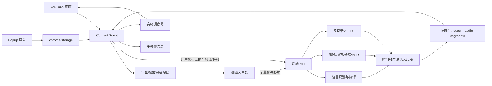

# 目标架构

## 设计目标

在保留 v2.7 页面集成方式的前提下，支持韩语、英语、日语到中文的稳定翻译，并为后续降噪、人声增强、音源分离、TTS 配音和精确同步提供边界。目标不是一次重写，而是先定义可替换接口，再逐步迁移重型能力。

## 浏览器与后端边界

### 保留在浏览器插件

- YouTube 页面与 SPA 导航检测。
- 视频 ID、字幕轨道和字幕 DOM 获取。
- 播放器时钟、播放/暂停/倍速/跳转事件。
- 字幕覆盖层、弹窗设置和用户授权入口。
- 小型缓存、请求取消、状态显示和错误降级。
- Web Speech API 作为离线或后端不可用时的基础朗读回退。

### 迁移到后端服务

- API 密钥与商业翻译/TTS 服务凭证。
- 韩/英/日语言识别、模型路由、批量翻译、术语表和缓存。
- 音频解码、重采样、降噪、人声增强和声源分离。
- 说话人分离/聚类、ASR 和说话人时间段生成。
- 高质量神经 TTS、分角色音色、音频文件生成和时长估计。
- 字幕与生成音频的强制对齐、时间伸缩和分段合成。
- 限流、任务队列、审计日志、存储生命周期和隐私策略。

浏览器可以通过 `tabCapture` 等能力获取当前标签页音频，但持续推理、模型体积、跨平台性能、凭证安全和长任务可靠性决定了生产级音频 AI 不应放在 content script 中。

## 建议组件



## 建议数据契约

先在插件内部统一 cue 结构，暂不改变外部行为：

```text
Cue {
  id,
  sourceText,
  translatedText,
  sourceLang,        // ko | en | ja
  targetLang,        // zh-CN
  startMs,
  endMs,
  speakerId?,
  confidence?
}
```

后端最小接口可按能力分开，而不是建立一个万能端点：

- `POST /v1/translate`: 接收带时间戳的字幕批次，返回相同 cue ID 的译文。
- `POST /v1/audio/jobs`: 创建音频处理任务，显式记录用户授权和处理选项。
- `GET /v1/audio/jobs/{id}`: 返回阶段、进度、错误和结果引用。
- `POST /v1/tts`: 接收译文、说话人和目标时长，返回音频片段元数据。

接口需要请求 ID、超时、取消、版本字段和明确错误码。音频不应默认长期保存。

## 两条运行路径

### 字幕优先路径（近期）

字幕轨道 → 源语言归一化 → 批量翻译 → cue 时间轴 → 字幕显示 → 本地 TTS/后端 TTS。该路径不处理原视频音频，成本低且最接近当前实现。

### 音频增强路径（后期、显式启用）

用户授权 → 捕获/上传音频 → 降噪与人声增强 → 声源/说话人分离 → ASR → 翻译 → 分角色 TTS → 强制对齐 → 插件按播放器时钟调度音频片段。

## 最小迁移策略

1. 不先拆成大量文件；先在 `content.js` 中定义统一 cue 和翻译参数，补测试样本。
2. 修正源语言选择和翻译缓存键，使 ko/en/ja 的字幕路径可验证。
3. 把翻译调用封装成单一 adapter；默认仍可使用现有 YouTube/MyMemory 路径。
4. 将 TTS 的“选声音、排队、取消、同步”收敛为一个调度器，再接后端 TTS。
5. 音频后端作为独立可选能力接入，不阻塞基础字幕翻译。

该顺序避免在没有测试和接口契约时直接引入音频模型或大规模目录重构。
